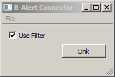

# Overview

The BAlert LSL Application is currently untested by should work with the B-Alert X4, X10 and X24 systems produced by Advanced Brain Monitoring (http://www.b-alert.com/).

**This is under construction. The Usage instructions below are outdated. The Build Instructions are likely to change.""

# Usage
  * Make sure that the device is turned on and properly connected.

  * Start the BAlert app. You should see a window like the following.
> > 

  * Click the "Link" button. If all goes well you should now have a stream on your lab network that has name "BAlert Xn" (n can be 4, 10 or 24) and type "EEG".

  * The filter setting can be saved in the config file for subsequent use via File / Save Configuration. It is also possible to make a desktop shortcut that appends to the shortcut's Target field the snippet `-c name_of_config.cfg`.

# Build Instructions

**Dependencies**:

* Latest [liblsl i386 release](https://github.com/sccn/liblsl/releases) -- download and extract somewhere convenient.
* ABM Athena SDK -- download and extract somewhere convenient.
* Qt 32-bit library (tested with 5.12) -- use the maintenance tool to install.

1. Clone or download this repository.
2. Open the repository root folder in Visual Studio 2019.
3. After it scans the root folder structure, it will report some cmake errors because it could not find the dependencies.
4. On the menu, click on Project > CMake settings for LSLBAlert
5. In the new window that opens, click on the green + sign to create a new configuration. Choose x86 Debug (or Release). Ctrl + S to save.
6. From the dropdown menu in the toolbar, change the configuration to x68-Debug.
7. In the cmake settings window, add/modify the following key-value pairs.
    * ABMAthena_ROOT_DIR -- {path to ABM SDK}
    * Qt5_DIR -- {Path to Qt install, probably C:\Qt\5.15.2\msvc2019\lib\cmake\Qt5}
    * LSL_DIR -- {PATH to LSL binaries}
8. 